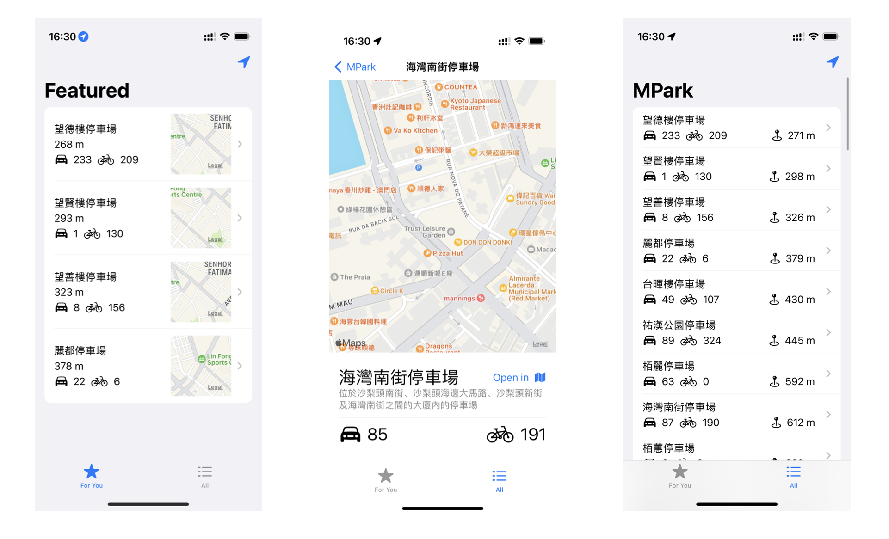

# MPark

MPark is the mobile side of our brand new MPark+ parking solution, designed specifically for Macao. MPark+ is a fully featured and comprehensive parking management system for drivers, parking lot owners, and city administrators. It features a modern, visually appealing UX/UI and an intuitive interface that results in an excellent user experience. MPark+ also provides drivers with a centralized location to access all the information and resources they need for efficient parking. This application is designed to streamline the parking process and reduce congestion.

### ScreenShots

## Software Development Plan

### Development Planning

The application was developed by Jamal. The target market consists of vehicle owners in Macao who currently struggle with finding available parking spots. The main market strategy is Time-to-market. The development focused primarily on user experiences related to finding and paying for parking.

### Estimated Costs:
- Cost of labor: $1000 X 12 months = USD 12,000
- Cost of equipment: $1200 (one-time cost for a MacBook Pro)
- Total cost: USD 13,200 (before official release)
- Maintenance costs are expected to be 10% of the annual revenue from app usage fees.

### Licensing Prices:
- Free app download with in-app purchases for advanced features.
- Subscription model for premium users: USD 5 per month.

### Development Process

We adopted Scrum - an Agile project management and product development framework to break down the project into smaller, manageable tasks and facilitate iterative progress. This approach enabled Jamal to deliver a high-quality application efficiently by focusing on a limited set of features at any given time.

#### Development Phases:
1. **Requirement Analysis**: Jamal gathered and understood the key requirements from potential app users.
2. **Sprint Planning**: Selected essential features for the upcoming sprint.
3. **Daily Standups**: Jamal reviewed progress and adjusted plans as necessary.
4. **Sprint Execution**: Developed the items from the sprint planning.
5. **Sprint Review and Retrospective**: Tested the features, gathered user feedback, and prepared for the next sprint.

### Members (Roles & Responsibilities)
- **Product Owner/Developer/Scrum Master (Jamal)**: Handled all aspects of development, from requirement gathering to deployment.

## Requirements / Planned Features / Product Backlog

- REQ - Requirement gathering from potential users (Completed)
- UI/UX - Design of user interface and user experience (Completed)
- API - Development of backend APIs for real-time parking data (Completed)
- INTEG - Integration with payment gateways (Completed)
- TEST - Thorough testing of the app (Completed)
- FEED - Collection of user feedback (Ongoing)
- UPD - Regular updates and feature additions (Planned)

## Current Status

- The app has successfully completed initial development and is now in the beta testing phase.
- Current progress: 75% complete.

## Future Plan

- Full launch planned for Q1 2024.
- Expansion to include additional cities.

## Demo

## Environments

- **Programming Language**: Swift 5
- **Required Tools**: Swift Playground
- **Operating System**:
  - iOS 17.4.1 or newer

## Declaration

- **Third Party Libraries**:
  - Alamofire for network requests
  - SwiftyJSON for JSON handling

- **Assets**:
  - Icons and images are sourced from Adobe Stock under a commercial license.
